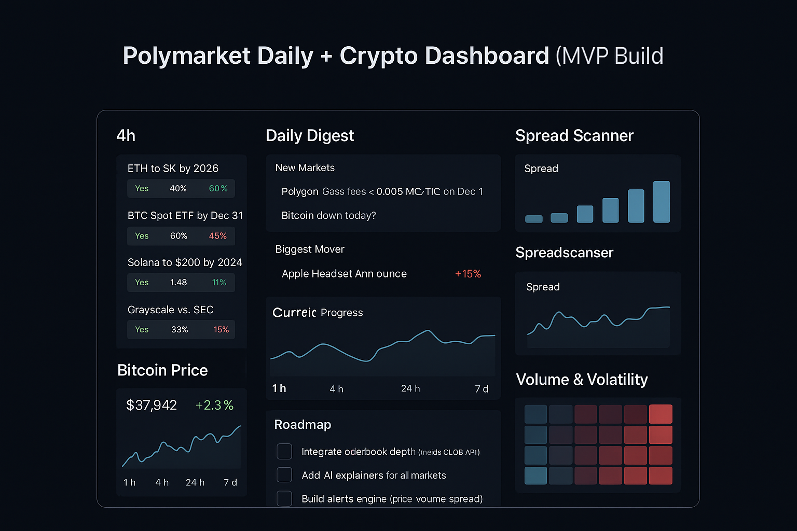
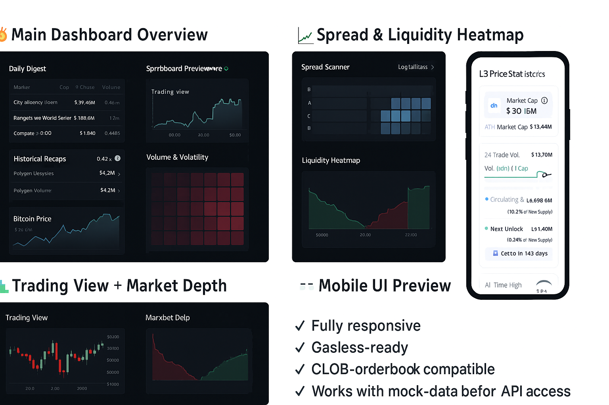
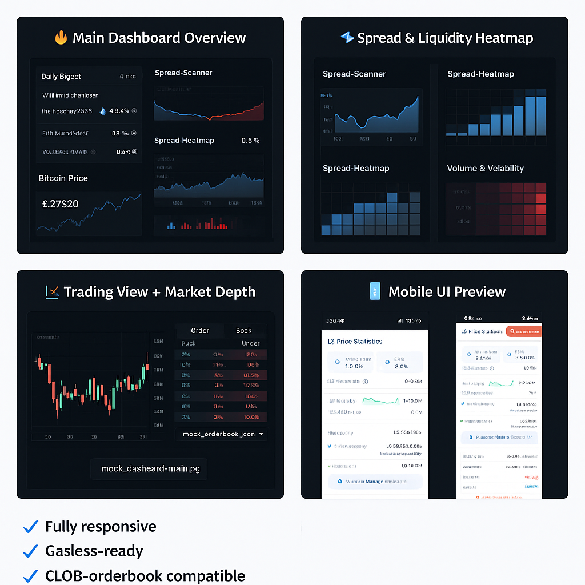
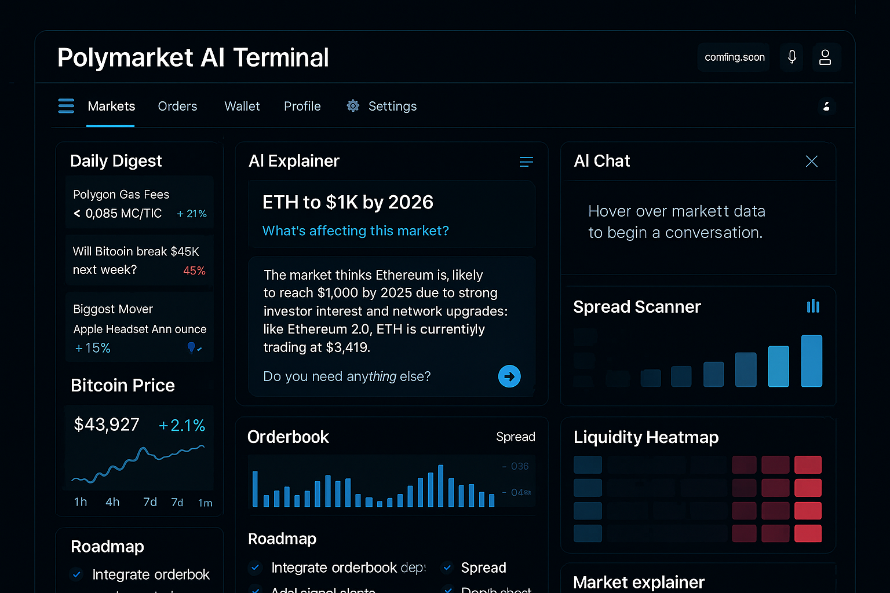
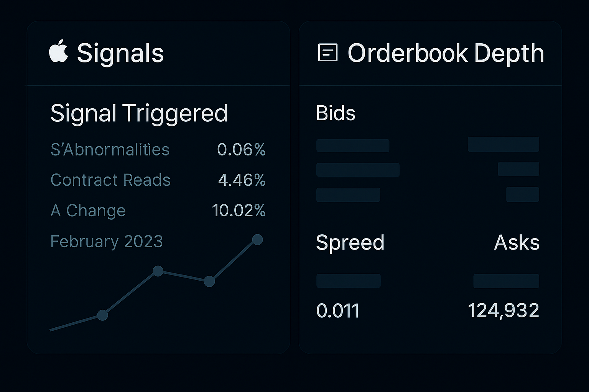

# 📊 Polymarket Daily Dashboard — Full Open-Source Analytics (Vite + React Build)

A modern analytics dashboard designed to make Polymarket markets easier to explore, understand, and trade.  
This build uses **mock datasets** for UI evaluation prior to CLOB API whitelist approval.

<p align="center">
  
</p>

<p align="center">
  
  
  
</p>

---

## 📚 Table of Contents
- [Key Features](#-key-features)
- [Dashboard Previews](#-dashboard-previews)
- [Project Structure](#-project-structure)
- [Included Mock Datasets](#-included-mock-datasets)
- [Tech Stack](#-tech-stack)
- [Architecture](#-architecture)
- [API Whitelist Request](#-api-whitelist-request)
- [Why This Dashboard Matters](#-why-this-dashboard-matters)
- [Local Development](#-local-development)
- [Roadmap](#-roadmap)
- [Contributing](#-contributing)
- [License](#-license)

---

# 🚀 Key Features

### 📈 Spread Scanner  
Quick insights across Polymarket YES/NO markets based on spread ranges (0.1–0.8).

### 📉 Orderbook Depth  
Mock CLOB-style visualization for UX preview before API access.

### 🔥 Liquidity & Spread Heatmap  
Shows relative liquidity + spread pressure across markets.

### 📲 Mobile Responsive  
Designed for desktop + mobile.

### 📡 Mock Data Mode  
Provides a **fully working dashboard without API access**.

---

# 🖼️ Dashboard Previews

> These preview images come from the `/assets/` folder.

## 🔥 1. Main Dashboard Overview
<p align="center">
  
</p>

---

## ⚡ 2. Spread & Liquidity Heatmap
<p align="center">
  
</p>

---

## 📱 3. Mobile UI & Stats
<p align="center">
  
</p>

---

## 🟢 4. Signals + Orderbook Depth Mock
<p align="center">
  
</p>

---

# 📁 Project Structure

```
polymarket-dashboard-full/
│── public/
│── src/
│   ├── components/
│   │   ├── Heatmap.jsx
│   │   ├── OrderbookView.jsx
│   │   ├── SpreadScanner.jsx
│   │   └── SignalsPanel.jsx
│   ├── App.jsx
│   ├── main.jsx
│   └── styles.css
│
│── assets/
│   ├── 1.png
│   ├── 2.png
│   ├── 3.png
│   └── 4.png
│
│── mock-data/
│   ├── mock_data.json
│   ├── mock_trades.json
│   ├── mock_spread_history.json
│   └── mock_orderbook.json
│
│── index.html
│── package.json
│── vite.config.js
│── dashboard-preview.png
│── README.md
│── LICENSE
```

---

# 📦 Included Mock Datasets

### 🟦 `mock_orderbook.json`
Simulated orderbook structure with:
- bid/ask levels  
- depth (L1–L5)  
- liquidity imbalance  
- spread calculation  

---

### 🟧 `mock_trades.json`
Synthetic trade stream with:
- timestamp  
- side  
- size  
- impact score  

---

### 🟥 `mock_spread_history.json`
Used for:
- heatmap  
- spread volatility  
- short-term signals  

---

### 🟨 `mock_data.json`
Top-level markets snapshot:
- YES/NO prices  
- volume  
- liquidity flags  
- trending markets  

---

# 🛠️ Tech Stack

- **React (Vite)**
- **CSS + utility classes**
- **Mock REST-style data**
- *(Future: CLOB REST + WebSocket)*

---

# 🧠 Architecture

```
Frontend (Vite + React)
│
├── Components
│   ├── Spread Scanner
│   ├── Orderbook Depth
│   ├── Heatmap
│   ├── Signals Panel
│
├── Data Layer (Mock)
│   ├── orderbook
│   ├── trades
│   ├── spread history
│   └── markets snapshot
│
└── Integration (Future)
    ├── CLOB REST endpoints
    ├── WebSocket streams
```

---

# 🔐 API Whitelist Request

**Status:** Pending review  
**Project is ready for immediate integration once approved.**

Endpoints prepared:

- `/orderbook`
- `/markets`
- `/trades`
- WebSocket feed  

---

# 🌟 Why This Dashboard Matters

Polymarket is expanding fast — but analytics tools are still limited.

This dashboard solves that by providing:

✔ Spread + liquidity detection  
✔ Orderbook visualization  
✔ Market discovery  
✔ Clean, production-ready UI  
✔ AI-ready architecture  

Built to support Polymarket traders, analysts, and Builder Program participants.

---

# 🛠️ Local Development

### Clone repository
```bash
git clone https://github.com/mailcrypto23/polymarket-dashboard-full
cd polymarket-dashboard-full
```

### Install dependencies
```bash
npm install
```

### Start development server
```bash
npm run dev
```

### Build for production
```bash
npm run build
```

---

# 🔮 Roadmap

### **Phase 1 — UI Complete**
✔ Dashboard  
✔ All components  
✔ Preview assets  
✔ Mock datasets  
✔ Responsive layout  

### **Phase 2 — API Integration**
▢ CLOB REST  
▢ WebSocket streaming  
▢ Market feed  

### **Phase 3 — AI Features**
▢ Market explainer  
▢ Reasoning engine  
▢ Smart alerts  

### **Phase 4 — Alerts**
▢ Spread alerts  
▢ Volume spikes  
▢ Liquidity pressure  

---

# 🤝 Contributing

PRs, ideas, and improvements are welcome!

---

# 📜 License  
MIT License — free to use, modify, and distribute.
